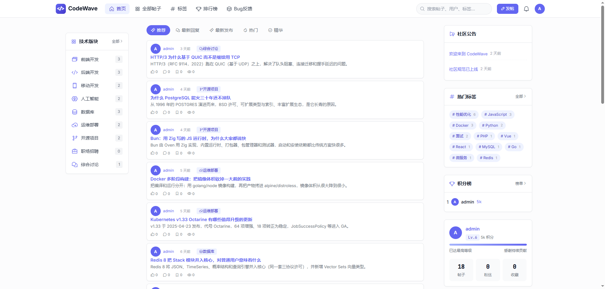
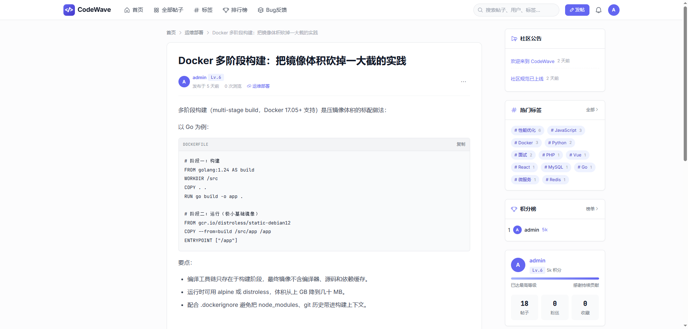
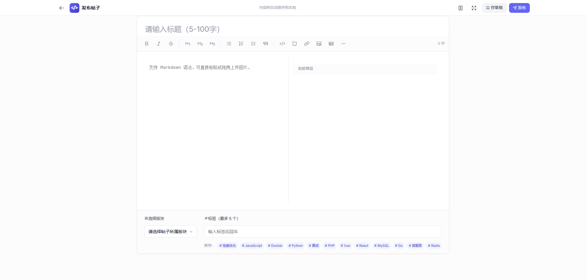
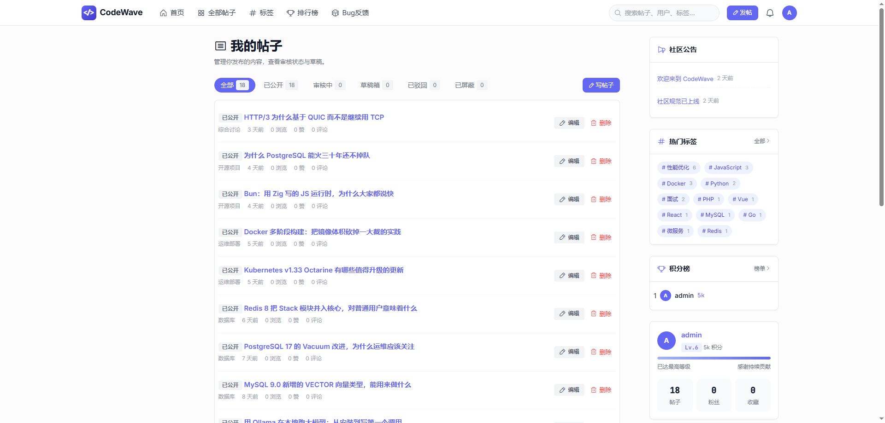
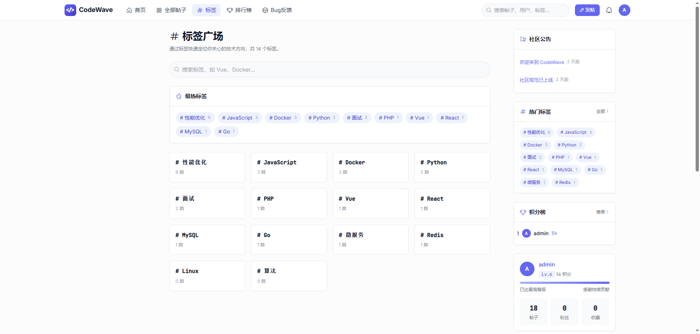
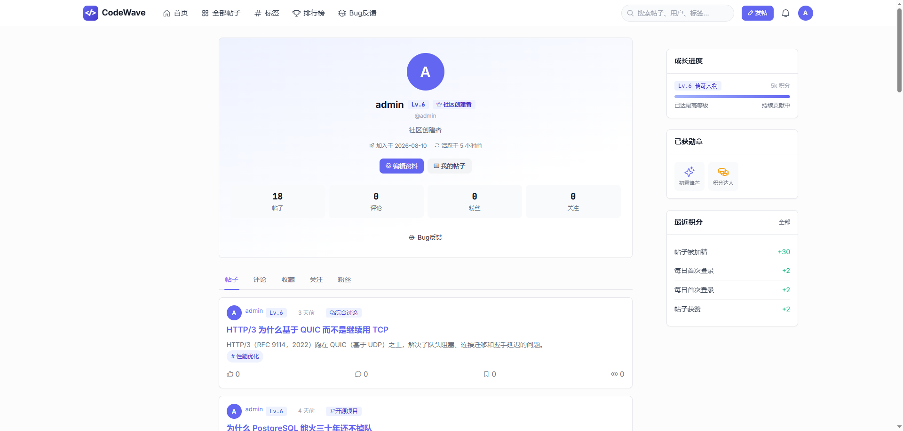
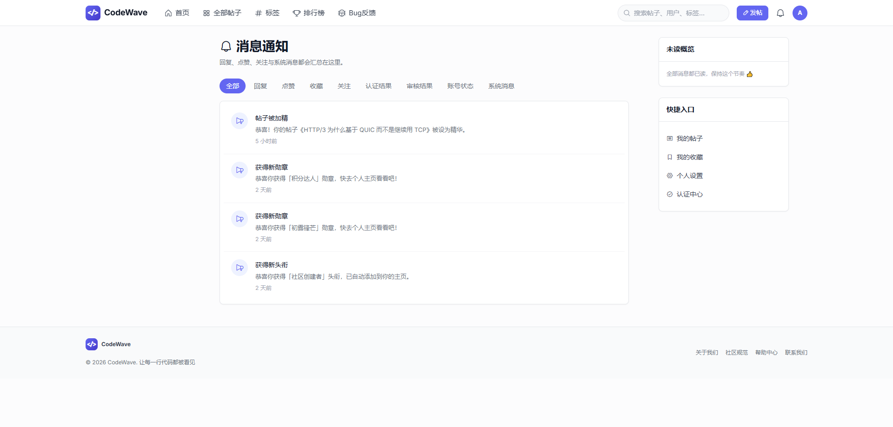
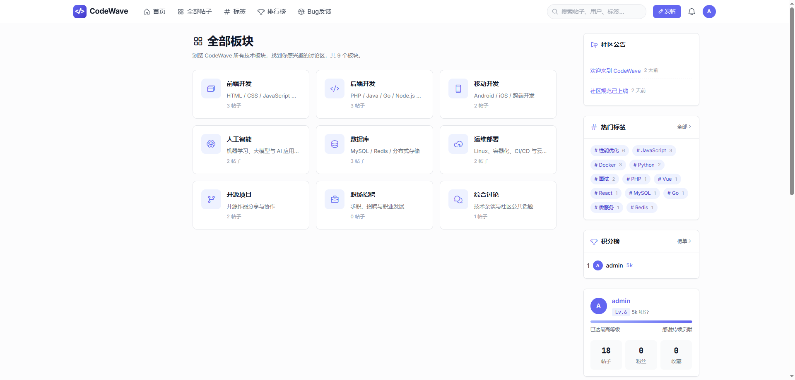
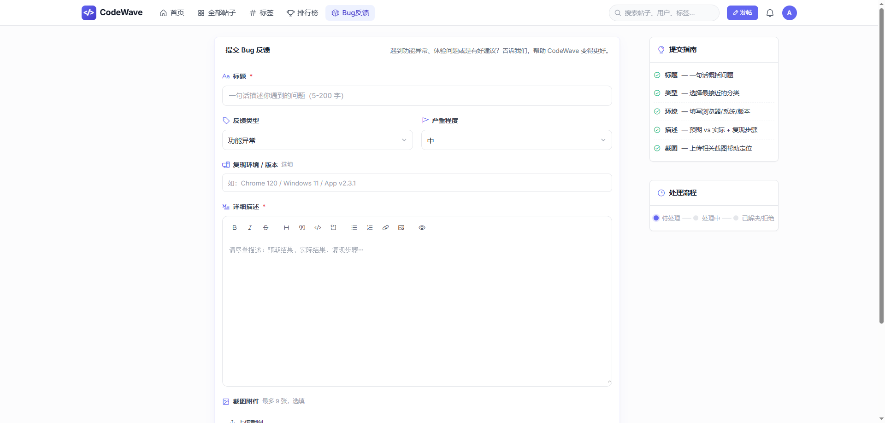

<!-- Tato · CodeWave -->

  

<h1 align="center">💜 CodeWave</h1>

  一个干净、现代的开发者社区论坛系统 
  让每一段代码、每一次讨论都被看见

  
  
  
  

---

## 这是什么

CodeWave 是一套面向开发者社区的轻量级论坛系统。麻雀虽小，五脏俱全：发帖回帖、标签分类、积分等级、用户认证、消息通知、后台管理、Bug 反馈等社区常用功能都包含了进来。

> 目前项目处于展示阶段，**没有部署线上域名**，截图仅供效果预览。

👉 在线预览（GitHub Pages）：**https://CodeWave-Tato.github.io/CodeWave**

---

## 效果预览

### 首页与内容流

| 首页帖子流 | 帖子详情 |
|:---:|:---:|
|  |  |

### 内容与创作

| 发布编辑器 | 我的帖子 | 标签广场 |
|:---:|:---:|:---:|
|  |  |  |

### 用户与互动

| 用户主页 | 消息通知 | 全部板块 |
|:---:|:---:|:---:|
|  |  |  |

### 反馈

| Bug 反馈 |
|:---:|
|  |

---

## 主要功能

- **帖子与评论**：Markdown 编辑器、实时预览、图片上传、标签与板块分类。
- **用户体系**：注册登录、邮箱验证、个人主页、积分、等级、勋章、关注与粉丝。
- **内容互动**：点赞、收藏、关注，互动行为触发站内与邮件通知。
- **消息通知**：回复、点赞、收藏、关注、认证、Bug 反馈状态集中提醒。
- **社区治理**：帖子审核、举报、封禁、申诉、社区规范、Bug 反馈工单。
- **后台管理**：仪表盘、内容审核、用户与板块管理、系统设置、日志查看。
- **安全稳定**：MVC 架构、CSRF 防护、登录限流、CSP 响应头、SQL 事务、日志脱敏。

---

## 技术栈

- **后端**：PHP 8.1+，纯原生 PHP 实现 MVC，不依赖大型框架
- **数据库**：MySQL 5.7+ / 8.0（utf8mb4）
- **前端**：Tailwind CSS + 少量原生 JavaScript
- **图标**：Phosphor Icons（前台）、Font Awesome（后台）
- **字体**：Inter / JetBrains Mono

---

## 部署

1. 整体上传服务器，运行目录设为 `/public`。
2. Nginx 配置伪静态：`try_files $uri $uri/ /index.php?$args;`
3. 访问 `/install/` 运行安装向导，按步骤填库即可。

---

## 说明

- 本项目用于开源展示与交流，**尚未部署可访问的线上域名**，截图数据均为本地演示数据。
- 喜欢就点个 **★ Star** 吧，你的支持是继续完善的动力！

---

Made with 💜 by Tato · CodeWave

